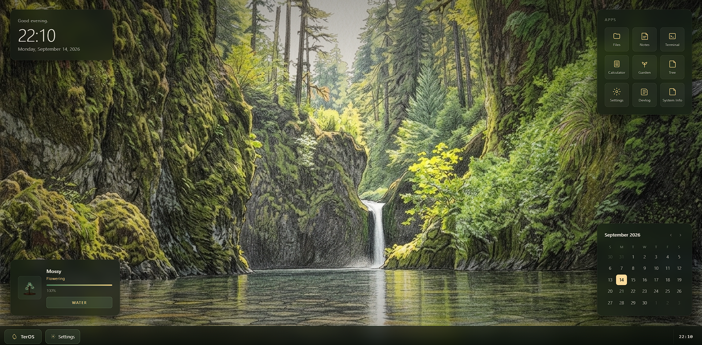
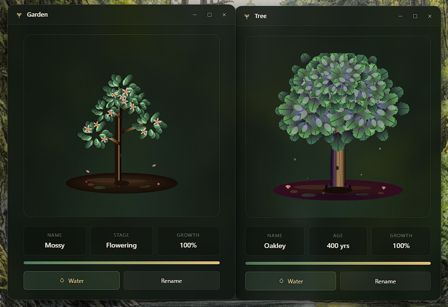

# TerOS

A WebOS that lives in your browser. Forest greens, retro desktop vibes, and a plant that "grows" while you use it.

I made this for the **Stardance challenge**. I wanted a browser OS that felt calm and nostalgic instead of another glassy clone of Windows. The name comes from the Greek word for "other", like a small alternative world inside a tab. Sounds cool tho it is kinda useless still nice to use.

---

## Screenshots

| Desktop | Garden |
|---|---|
|  |  |

---

## What's in it

There are 10 apps: Calculator, Calendar, Terminal, Notes, Files, Garden, Tree, Settings, Devlog and System Info.

- **Files** is a fake filesystem. You can make folders, rename, move, delete, search and sort, and there are breadcrumbs so you don't get lost.
- **Notes** is a plain text editor with autosave, search and timestamps.
- **Terminal** understands `help`, `ls`, `cd`, `tree`, `mkdir`, `touch`, `cat`, `rm`, `pwd`, `date`, `time`, `echo`, `neofetch`, `clear` and `about`. There are also a few hidden commands. Go find them.
- **Garden** has a plant that grows just because you're using TerOS. Watering it speeds things up. I'm not telling you how it works.
- **Tree** is a separate tree that slowly develops the longer you hang around.
- **Devlog** is the dev history of the project, from the early V0.1 builds up to V1.0. It covers how things changed along the way, not just a feature list.
- **System Info** shows basic info about your TerOS setup.

---

## Running it

It's three files:

```text
TerOS/
├── index.html
├── styles.css
├── teros-app.js
└── teros-core.js
```

No build step and no dependencies. Open `index.html` in your browser and you're done, or serve the folder with whatever you like:

```bash
python -m http.server
```

It works fully offline too.

## Or check it out at : https://vmechlab.github.io/TerOS/

---

## Keyboard and mouse

- **Meta / OS key**: toggle the start menu
- **Alt + Tab**: cycle window focus
- **Escape**: close menus and modals
- **Double-click a window header**: maximize / restore
- **Drag a window to the left or right edge**: snap it
- **Drag a window to the top edge**: maximize

---

## Look and feel

Dark forest greens, cream, beige and sage, with frosted panels and pine silhouettes. The wallpapers are procedural SVGs generated in code, so TerOS doesn't need any image files for its backgrounds. You can still upload your own wallpaper if you want. Icons are inline SVG and the animations are kept small.

Built with plain HTML, CSS and JavaScript. No frameworks, no backend, everything runs in the browser. Simple asf.

---

## Roadmap

**V1.0** It has the desktop, window manager, core apps, fake filesystem, persistent storage, garden, themes and wallpapers.

**V1.1** Just went back to the previous version that had that " retro feel " and not just AI lookalike.

**V2.0** is coming for WebOS2 by Stardance. Planned so far:

- Music player
- Weather app
- More garden stuff
- More interactions
- a " easter egg " that you will be able to find in it

More ideas will probably show up as I go.

---

## About

TerOS is a simple solo project. It started as " hmm 50 stardust. I want it" and ended up eating 20h+ of my like and will eat more I think.

Hope you like my little creation. Muahahaha

---

## License

MIT. Do whatever you want with it.
